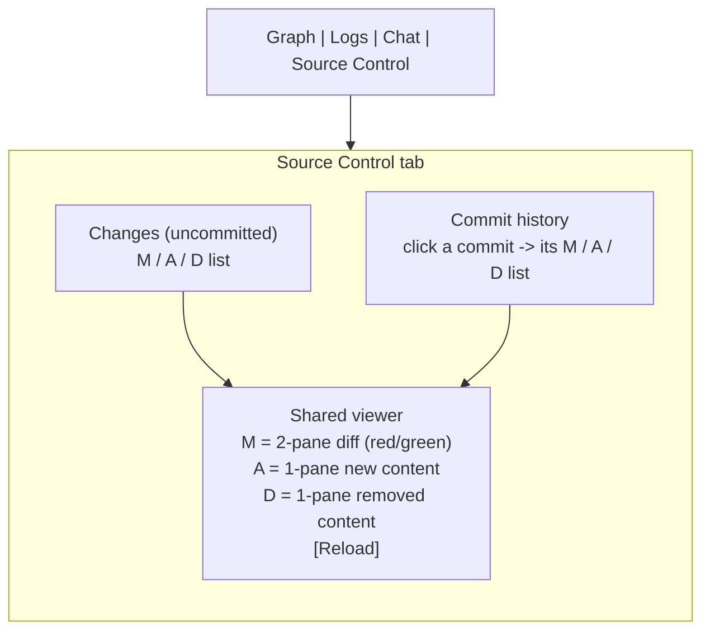
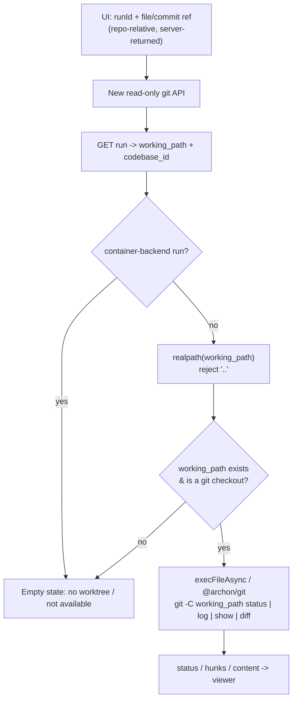
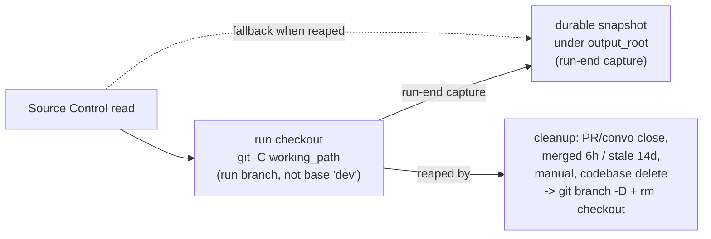

# Addendum — Archon Source Control tab (technical depth for architecture)

Downstream-technical content that does not belong in the PRD narrative. Inlined (not referenced) so an isolated Archon implementation agent has the full contract locally. Derived from the brainstorm + spec companions.

## Read model (source of truth)

- **Live checkout is the source of truth.** Read via `git -C <working_path>` (status / log / show / diff) against the run's own checkout. The checkout shares the repo object store, so the run branch's commits are readable there.
- **Do not read the base checkout.** `default_cwd` sits on the base branch (`dev`); the run branch is invisible there unless merged. Read from the Run checkout, not base.
- **Read by `working_path`, uniformly — after the D5 container gate.** First, the **D5 container gate** runs: a run whose isolation-env `provider === 'container'` routes to the Empty state **before any git read** (the host `working_path` is stale for container runs). Every _non-container_ run backed by a host git checkout — isolated worktree, in-place, or `--no-worktree` repo — is then read the same way, by `working_path`; among those there is no worktree-vs-non-worktree branching, and presence is decided by directory existence + "is it a git checkout" at read time (never by run status).
- **Events are provenance only.** The workflow event stream is NOT authoritative for what changed (shell / `sed` / scripts / subprocesses / renames / deletes mutate files without a structured path event). Use events, if at all, only as a hint layer (which node/log line may relate to a file) — never as the change list.

## Path pinning

- Resolve the checkout **server-side** from `runId`: read `working_path` + `codebase_id` from `GET /api/workflows/runs/{runId}`. Never accept the checkout root or an absolute/filesystem path from the client; accept only a server-returned repo-relative path, realpath-validated under `working_path` (path-traversal guard); reject any `..`.
- **realpath** the path: runtime showed the same logical tree referenced under two different absolute root strings (`/Users/agent/.archon/...` and `/Volumes/WD_BLACK/archon/...`); the cause (symlink / mount / relocation) is unconfirmed. Realpath and tolerate the divergence; a stale `working_path` breaks reads.
- `working_path` is written to the run cwd by `executeWorkflow`; it is NOT null for folder / `--no-worktree` runs. A **null** `working_path` is a missing/legacy state → Empty state.
- Submodules are initialized `--recursive` into an isolated worktree on create.

## New read-only git API (none exists today)

Model on the existing artifact route: `GET /api/artifacts/:runId/*` + `resolveRunArtifactDir` resolve the path server-side and reject `..` (`packages/server/src/routes/api.ts` ~5071-5078). `@archon/git` today exposes only a boolean `hasUncommittedChanges` (`git status --porcelain`, `packages/git/src/branch.ts`).

Minimal endpoints (all resolve `working_path` from `runId`, realpath, reject `..`, run through `execFileAsync` / `@archon/git` with server-controlled args):

| Endpoint    | Purpose                                   | Git                                                                                                                                                                                                                                                                 |
| ----------- | ----------------------------------------- | ------------------------------------------------------------------------------------------------------------------------------------------------------------------------------------------------------------------------------------------------------------------- |
| status      | Now changed files (`M`/`A`/`D`)           | `git status --porcelain` projected to M/A/D                                                                                                                                                                                                                         |
| log         | commit history (graph) for the run branch | `git log` — record **adds `parents[]`** (format includes `%H %P` alongside author / date / subject, NUL-delimited); parents drive the branch/merge lanes                                                                                                            |
| show / diff | file content / diff                       | `M`: `git diff` hunks (`parent..commit` history, `HEAD..worktree` Now); `A`/`D`: content via `git --literal-pathspecs ls-tree -z <oid> -- <path>` (exactly one entry) + `git cat-file blob <blobOid>` (`D` uses the parent OID). No `<oid>:<path>` revision syntax. |

Follow Archon route rules: `registerOpenApiRoute(createRoute(...), handler)`; use the raw `app.get(...)` exception only for wildcard/non-JSON responses (the artifacts-route precedent), with the explanatory comment. `@archon/web` consumes OpenAPI-generated types only (no import from `@archon/workflows`).

Read-containment: validate a full commit OID from `log` (hex + reachable); live raw reads realpath-contain under `working_path`; do NOT reject `:` / leading `-` / glob metachars in filenames (valid — FR-5) — use `--literal-pathspecs` + `--`/argv; reject NUL / absolute / encoded-`..`. Tests: symlink escape, encoded traversal, invalid ref, unreachable OID refused; colon / leading-dash / glob-metachar filename success.

## Viewer and diff rules

- **Two regions, one list widget, one viewer.** Changes (uncommitted) on top, commit history below (rendered as a branch/merge **lane graph**; the renderer is **spike-selected** — reuse `@xyflow/react` or a bespoke SVG, either with no new dep — see architecture); both feed the same list + same Viewer; only the read scope differs.
- **Three states only: `M` / `A` / `D`.** Untracked-new files use the `A` mechanism. Projection of other git statuses: rename → `D` (old path) + `A` (new path); copy → `A`; type-change → `M`; unmerged → `M`.

| Status       | Viewer                            | Coloring                    |
| ------------ | --------------------------------- | --------------------------- |
| `M` modified | Two-pane diff                     | red = before, green = after |
| `A` added    | Single pane, new-file content     | none                        |
| `D` deleted  | Single pane, removed-file content | none                        |

- `M` is diff-only in v1 (no standalone snapshot mode).
- **Diff direction:** Now = `HEAD → worktree`; selected commit = `parent → commit`. Before = left/red; after = right/green.
- **Refresh:** manual Reload; no auto-refresh/polling. Offer a "changed — Reload" affordance rather than mutating the open view under the reader.

### Every file opens (large + binary) — defaults, tunable at build

- **Large text:** stream in chunks with "Load more" — first paint ~256 KB / ~2,000 lines; for `M`, send diff hunks + 3 lines of context rather than the whole file.
- **Skeleton first + Cancel:** list and sizes render immediately from metadata; the Viewer paints a skeleton while bytes arrive, with a Cancel affordance. Files > ~1 MB stream with Cancel; files > ~50 MB offer download only.
- **Binary:** detected by a NUL byte in the first 8 KB (git heuristic); never dumped as text. Images (png/jpg/gif/webp/svg) render inline; other binaries offer download + a hex peek of the first ~4 KB.
- Nothing is blocked: every file opens or presents a usable fallback.

## Durable snapshot (FR-9, fast-follow)

- **Mechanic:** at run-end the server writes a git-snapshot — name-status (`M`/`A`/`D`), per-file unified diff, `A`/`D` file content, and the commit `log` (records **include `parents[]`** for lanes, plus author / date / subject) — as an artifact under the run row's `output_root` (written once at run start; persists after checkout teardown).
- **Read order:** live checkout is primary while it exists; the snapshot is the fallback once the checkout is reaped.
- **Undecided at build:** the wire format (a JSON manifest). The trigger is **run-end** (decided). The manifest must serve the same read API (status/log/show/diff) as the live path.

## Container-backend exception (v1 non-goal)

Folder-container runs keep the same host `working_path`, but changes live in an overlay volume and reach the host path only at write-back (`packages/isolation/src/backends/container.ts` ~4-16; `types.ts` ~487-501). Reading the host path mid-run shows stale state → v1 renders the Empty state for container runs. Reading the overlay (docker exec git / overlay diff walk, handling suspended/finalized containers) is a post-v1 upgrade. Host checkouts are unaffected.

## Lifecycle / GC facts

- A terminal run status does NOT itself trigger checkout removal. Removal is triggered by: conversation / PR close; the cleanup scheduler (merged ≈ 6h, stale ≈ 14d); manual command; codebase delete; orphan cleanup (`packages/core/src/services/cleanup-service.ts`; env status `active|destroyed` at `packages/isolation/src/types.ts:28`).
- `destroy` removes the checkout and runs `git branch -D`. Post-cleanup GC: unmerged run commits may become unreachable — hence the Durable snapshot for lasting history.
- The Source Control feature reacts by directory-existence check at read time; it does not own or mutate lifecycle.
- Validation task (implementation): confirm the read-time existence check against the real remote host (never `stat`'d during planning — no fs endpoint / SSH).

## Key Archon code references

- `packages/web/src/components/workflows/WorkflowExecution.tsx` — run screen; already reads `workingPath`.
- `packages/workflows/src/schemas/workflow-run.ts` — `WorkflowRun` (`working_path` nullable, `codebase_id`, `output_root`).
- `packages/isolation/src/providers/worktree.ts` — worktree create/`git worktree add`/submodule init.
- `packages/core/src/services/cleanup-service.ts`, `packages/isolation/src/types.ts` — cleanup + env status.
- `packages/server/src/routes/api.ts` — artifact route pattern (`resolveRunArtifactDir`, `..` rejection) to model the new git-read API on.
- `packages/git/src/branch.ts` (`hasUncommittedChanges`), `packages/git/src/worktree.ts` (list/remove helpers).

## Diagrams

### Tab layout

### Read request resolution (security)

### Truth model — live checkout vs durable snapshot

