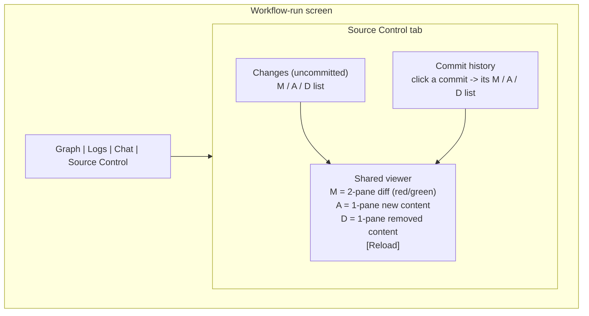
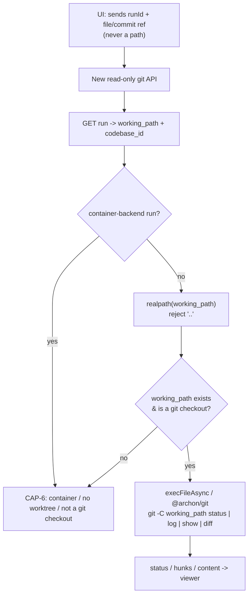
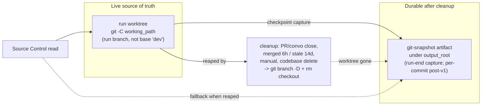
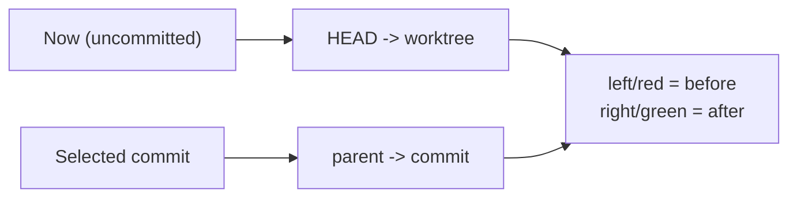

# Architecture diagrams

Diagrams for the Source Control tab. Prose lives in SPEC.md / other companions; the kernel references this file by name.

## Tab layout (CAP-1)

## Read request resolution (CAP-5, security)

## Truth model — live worktree vs durable snapshot (CAP-4, CAP-8)

## Diff direction (CAP-3)

