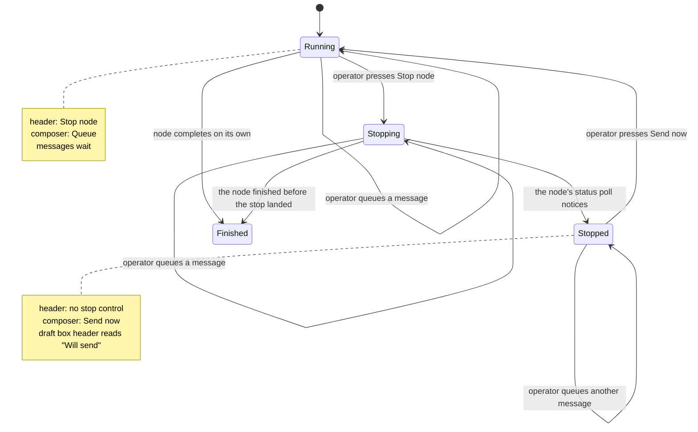

# Control states

The two controls in a node room — the stop control in the header and the send control on the composer — and what each reads in every node state.

Both follow **node state**, never a mode the operator has to remember setting. There is no toggle anywhere, so there is nothing to leave in the wrong position.

## The table

| Node state   | Header                | Composer        | What sending does                                                                                                                                                  |
| ------------ | --------------------- | --------------- | ------------------------------------------------------------------------------------------------------------------------------------------------------------------ |
| **running**  | `Stop node`           | `Queue`         | Holds the message. The node is untouched — nothing interrupted, nothing lost.                                                                                      |
| **stopping** | `Stopping…`, disabled | `Queue`         | The stop is in flight. The node notices on its status poll, so this state can last several seconds and must be shown rather than hidden behind an optimistic flip. |
| **stopped**  | —                     | `Send now`      | Waits for the node to report ready, delivers every queued message plus the one just typed in written order, then the node resumes.                                 |
| **finished** | —                     | _open question_ | Undecided: does a message re-run the node, or is the composer simply absent?                                                                                       |

The transition is **symmetric and automatic**. The moment the node resumes, the composer says `Queue` again and `Stop node` returns to the header — same instant, same signal. Nothing stays stuck in send mode after a resume.

## Why the stop is explicit

A send control offered _while running_ would have to stop the node to work, on every provider as they are wired today — none of the five has an inbound channel yet, whatever its own protocol allows. A control that silently stops an agent is a control that lies about what it does. Making the stop explicit costs one click and buys an interface that matches its own mechanism.

When mid-turn delivery lands (CAP-5), a second path appears **while running** — send without stopping — and it is honest at that point because the mechanism genuinely does not stop anything. The states above do not move; one gains an extra option.

## Behaviour inside a state

**Queueing.** A newly typed message joins the **end** of the queue rather than jumping it, so the agent reads corrections in the order the operator thought of them.

**No per-item send while running.** While the node runs there is nothing an individual message can do except wait, so the only per-item actions are keep and delete. Offering a per-item send there would be the same lie as a running-state send control.

**The draft box.** Rendered only when it holds something — never an empty shell. Its header reads `Queued` while running and `Will send` while stopped; that one word is what signals the control below it is now live.

**On send.** Every queued item leaves the box before delivery starts, so nothing can be picked up twice. If delivery fails, items return to the front of the queue rather than being dropped.

**Send waits for ready.** `Send now` does not drive the resume off the back of the stop. It waits for the runtime to report the node ready, then delivers, then resumes. aion hit exactly this race and left the comment about it; the two steps stay two steps.

**Nothing follows the busy signal.** Controls follow node state, and the draft box follows whether it holds anything — never "is the agent busy right now", which is an async signal that flickers and makes the affordance appear and disappear under the operator's cursor.

**Message status.** Three states, and the third is only reachable on a provider that echoes back the id we stamped: in the draft box → `sent` → `delivered`. Where no echo exists, a message never advances past `sent`, and the interface does not pretend otherwise.

## What the stop control must not imply

Stopping saves session state up to the last completed tool call. It does **not** roll back files the agent already wrote. The control means "go no further", never "undo" — and the wording has to carry that, because an operator stops exactly when they believe something is going wrong, which is when they are most likely to assume it cleans up after itself.
