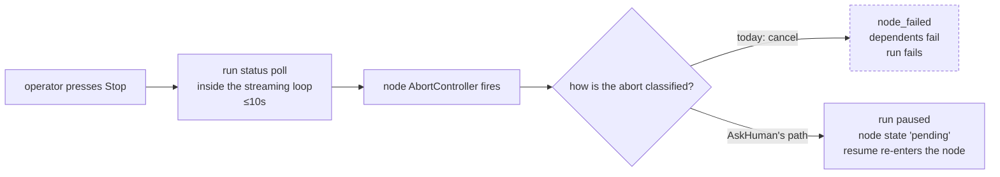

# Engine integration

Everything between the browser and the provider seam. The provider matrix answers _can the agent hear us_; this answers _can anything in Archon reach the agent to speak_. Three findings, each verified against source, and each one decides work the capabilities cannot be built without.

## 1. A running node already listens — it just answers wrong

A node streaming a provider response polls the database while it streams:

> `packages/workflows/src/dag-executor.ts:2304-2334` — every `CANCEL_CHECK_INTERVAL_MS` (**10 seconds**, `:682`) the streaming loop reads `deps.store.getWorkflowRunStatus(...)` and aborts the in-flight stream when the run is no longer streamable.

So an out-of-band signal **can** reach a running node. That is the mechanism a stop control needs, and it already exists. Two details shape how it gets used:

- **`paused` does not stop a node.** `shouldContinueStreamingForStatus` (`:700-702`) returns true for both `running` and `paused`, deliberately: a concurrent gate must not kill a sibling mid-stream (`:2306-2309` — "the paused gate owns workflow progression, not individual node lifecycles"). An operator stop therefore needs its own signal; it cannot ride the run's pause status.
- **It is not instant.** Up to ten seconds pass between the operator pressing Stop and the node noticing. The interface must not present the stop as immediate.

**What is wrong is the outcome, not the reach.** When the abort fires during streaming the executor records `node_failed` with `error: 'Cancelled by user'` and calls `recordFailedStatus(...)` (`:3124-3157`, and the classifier at `:3386-3394`). A failed node fails its dependents and the run — which is not what a stop should mean.

And the classifier already knows how to make exceptions: it excludes `AskHumanNoStarterError` and `AskHumanPauseFailedError` before reaching for "Cancelled by user". An operator stop needs the same kind of exclusion.

## 2. Stopping without failing: AskHuman already does it

This is the precedent, and it is close enough to be the design rather than an analogy:

> `ask-human.ts:110-124` — the tool pauses the run, then throws `AskHumanAwaitingError`.
> `dag-executor.ts:3339-3347` — the executor catches it, calls `pauseOnAskHuman(...)`, and returns `state: 'pending'` — **not** failed.

Interrupt a live turn mid-node, pause rather than fail, and let resume re-enter the _same node_ with an injected message. That is CAP-2 and CAP-3 with the interface removed. The parts that differ are small and nameable: AskHuman is triggered from _inside_ the turn by a tool call, where an operator stop arrives from outside through the poll in §1; and AskHuman's injected message is an answer to its own question, where an operator's is unsolicited.

**Settled: route the operator stop into this path.** The alternative — a per-node suspended state the executor respects — was weighed and rejected by the product owner. It would let independent nodes keep going, but it changes the executor and every path that reads node state, and the workflows this serves are mostly sequential chains where nothing else was going to run anyway.

The blast radius that comes with the choice, accepted knowingly:

> Under run-level pause, nodes already streaming in the same layer finish their own output, and **no later layer starts** — including nodes independent of the stopped one. The run waits for the operator to send.

What is left to build on top of the existing path is small: a trigger the poll in §1 can see, an exclusion in the cancel classifier beside the two AskHuman errors already there, and a resume that carries the operator's text into the re-entered node.

## 3. Where the executor runs, and when it matters

| How the run started | Where the executor runs                                                                                                           |
| ------------------- | --------------------------------------------------------------------------------------------------------------------------------- |
| Web dispatch        | **In the API server process** — `packages/server/src/routes/api.ts:3200-3228` dynamically imports `executeWorkflow` and awaits it |
| CLI `--detach`      | **A detached child in its own process group** — `packages/cli/src/commands/workflow.ts:696-722`                                   |

This matters less than it first appears, because the stop signal of §1 travels through the **database**, not through memory — so it reaches a detached run exactly as well as an in-process one.

The process boundary binds only the low-latency path. CAP-5's mid-turn delivery hands a message to a live child process through the provider seam, and that requires the executor to be in the process holding the route. Same for anything faster than the ten-second poll.

If mid-turn delivery must eventually reach detached runs, one lead exists: grok's leader socket (`~/.grok/leader.sock`, `grok agent leader`, `--leader` — "multiple clients share one backend"). It is the only channel found in any of this research that reaches a session the caller did not spawn. Unexplored, and grok-only.

## 4. An operator row needs a speaker

`workflow_node_messages` rows carry `kind: text | tool | status` and no speaker field (`packages/workflows/src/schemas/node-message.ts:39-43`). The obvious place to put one is `metadata` — but `nodeTranscriptMetadataSchema` is `.strict()` (`packages/workflows/src/schemas/node-execution.ts:29-43`), so it is **not** free JSON.

**Decision: an operator message is an ordinary `text` row carrying `metadata.origin = 'operator'`.** No new table, no widened `kind` enum — the same lesson aion recorded for itself (reuse existing enum values rather than widen a CHECK constraint). The cost is honest and small: an optional field added to a strict schema, plus a regenerated `api.generated` for the web. No database migration, because the column is already JSON.

**This reaches outside the spec.** `AgentHistoryItem` in `spec-readable-agent-transcript` has kinds `assistant | tool | lifecycle`; an operator row is none of them, and that spec's AD-1 puts every row's meaning in the shared core. CAP-4 therefore depends on a new item kind and a row treatment in **both** shells over there. Recorded here as a dependency; that spec is not edited from this one.

## What this adds to the build

Ordered by what blocks what:

1. Add the operator stop signal and its exclusion in the cancel classifier, then route the stop into `pauseOnAskHuman`'s ending. The poll that carries the signal already exists; so does the resume that re-enters the node.
2. Carry the operator's queued text into that resume, in written order.
3. Add `origin` to the transcript metadata schema, and open the matching change against `spec-readable-agent-transcript`.
4. Then the provider seam — which is what the matrix describes, and which was never the hard half.
