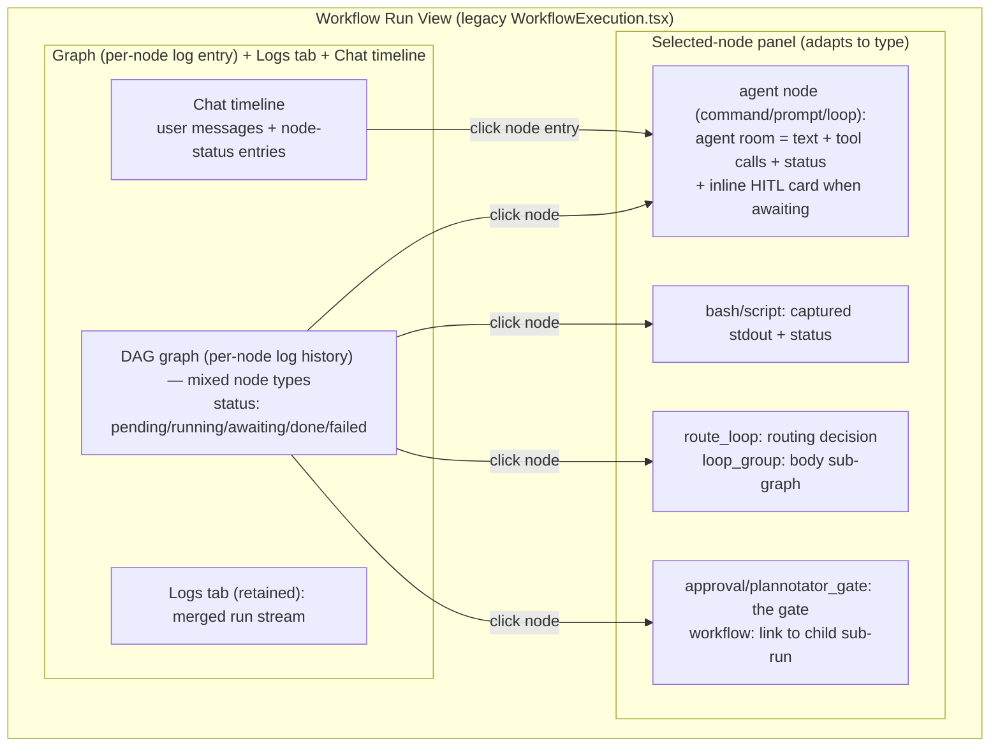
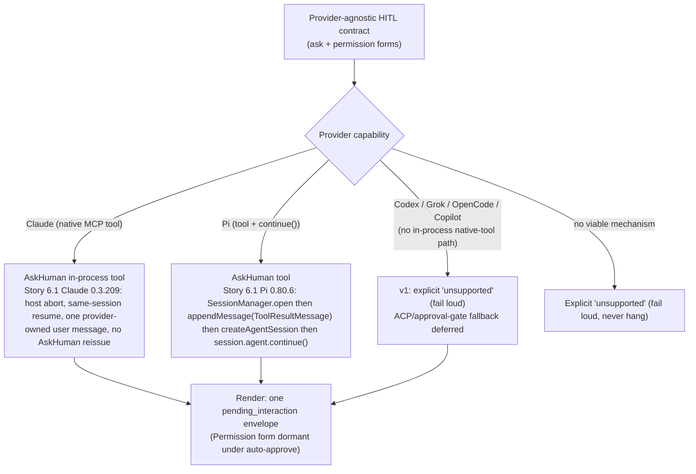

# Architecture Diagrams

Diagrams for the node-centric run view and the HITL lifecycle. Prose lives in `SPEC.md` and `hitl-contract.md`; this file holds the visuals only. Target surface is the legacy `WorkflowExecution.tsx`.

## Run view layout (CAP-1, CAP-2, CAP-3)

All three surfaces are retained (Graph / Logs / Chat). The **Graph** is now also a per-node log-history entry point (click a node → its agent log); the **Logs** tab is kept as-is; the **Chat** surface becomes a user-turns + node-status timeline. The selected-node panel **adapts to node type** — not every node is an agent session.



## HITL lifecycle (CAP-4, CAP-5) — durable target

Structured, agent-signaled block → inline card → typed response → only that node's turn resumes.
`hitl-contract.md` defines payloads; Story 6.1 evidence defines the provider resume protocols.

```mermaid
sequenceDiagram
  participant Agent as Agent node (command/prompt/loop)
  participant Engine as Run engine
  participant Room as Node room (UI)
  participant User as Human

  Agent->>Engine: AskHuman tool call (Ask) / permission path (Permission)
  Note over Agent,Engine: never prose; NL is not a wire format.<br/>NOT a declared approval gate (that is a separate node)
  Engine->>Engine: node -> awaiting; persist pending interaction (sessionId, tool_use_id)
  Engine->>Room: normalize -> pending_interaction envelope (ask | permission)
  Room-->>User: inline card in the node room
  User->>Room: respond (typed per form)
  alt Ask
    Room->>Engine: answer(request_id, answers[] | decline)
  else Permission
    Room->>Engine: confirm(call_id, intent)
  end
  Engine->>Agent: re-drive turn — Claude 0.3.209: host abort, same-session options.resume, one provider-owned user message, no AskHuman reissue | Pi 0.80.6: SessionManager.open then appendMessage(ToolResultMessage) then createAgentSession then session.agent.continue()
  Agent->>Engine: node resumes -> completion
  Note over Room: card stays in history as a record
```

## Provider production paths (CAP-7)

One provider-agnostic contract; production mechanism differs per provider; unsupported fails loud.


