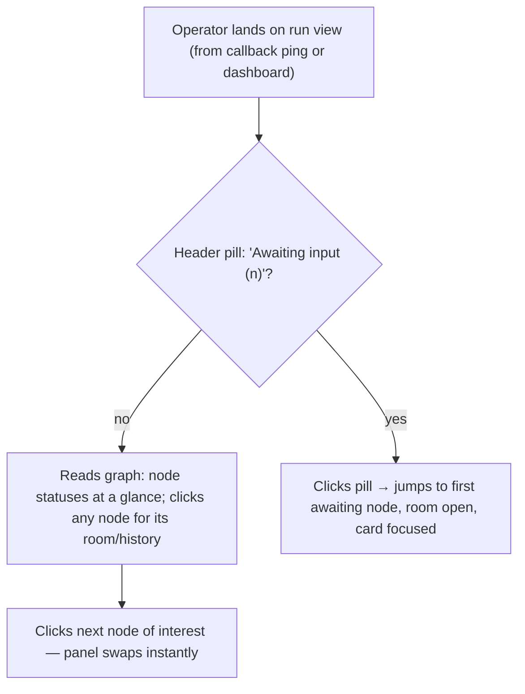
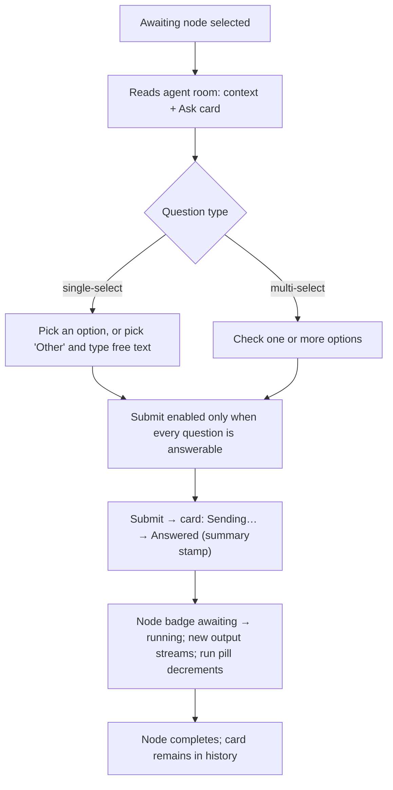
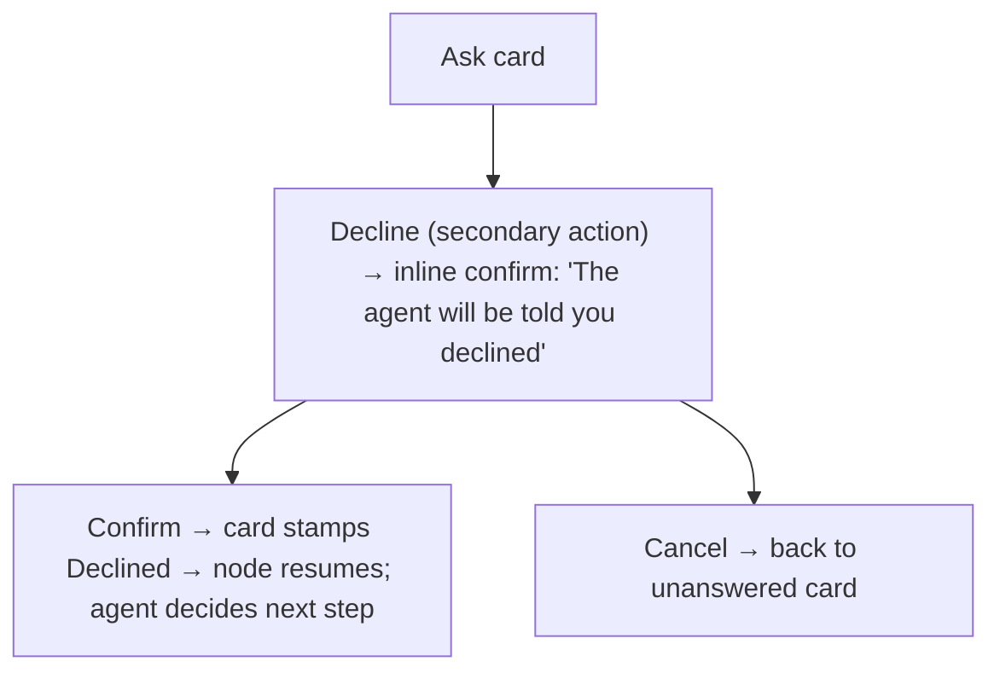
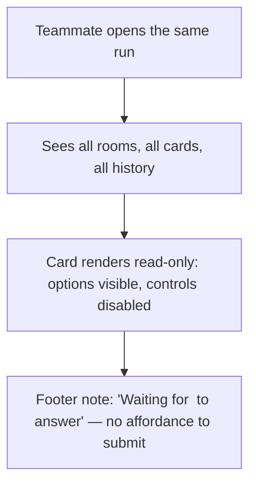
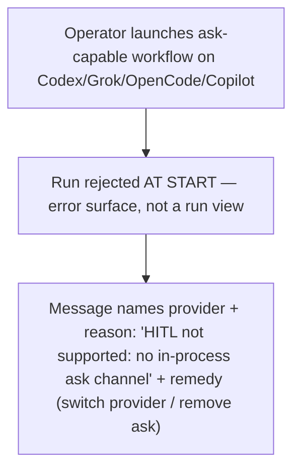
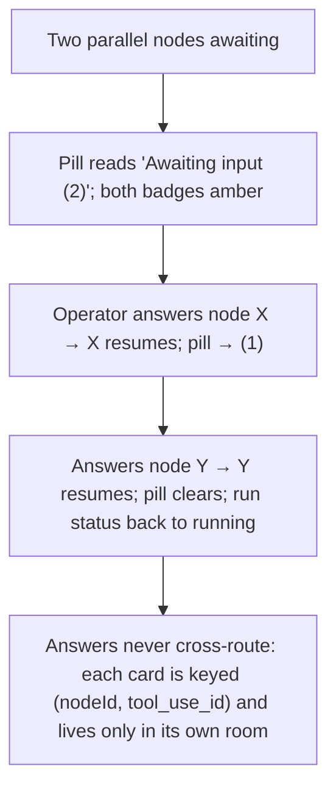

# UX Design Specification — Workflow Run View: Node-Centric Graph + Interactive Per-Node HITL

> Placement note: the BMAD create-ux workflow defaults to `_bmad-output/planning-artifacts/ux-design-specification.md`.
> This document lives beside `SPEC.md` instead, following this project's spec-companion convention (`hitl-contract.md`, `architecture-diagrams.md`).
> The interactive prototype replaces the workflow's static `ux-design-directions.html` showcase, per the stakeholder's request for a website they can interact with.

---

## Executive Summary

### Project Vision

Turn the workflow-run view from a merged firehose into a node-centric instrument panel: the DAG graph is the primary object, every node owns its panel and its history, and a blocked agent becomes an inline structured conversation — never a dead end.
One shared HITL contract feeds two thin renderers (legacy run view and `/console`), so the surfaces can never diverge.

### Target Users

The primary user is the **operator** — an engineer who launches a workflow run and steps away, then returns to follow it node-by-node and unblock agents that need a human.
They are highly technical, keyboard-comfortable, and read diffs/logs fluently.
They arrive via a pull-me-back ping (existing callback flow) and land directly on this view; the view's job is orientation + interaction, not notification.
Secondary user: a **teammate** (non-starter) who opens the same run to observe — they can see everything but cannot answer (contract: only the run starter answers).

### Key Design Challenges

1. **Attention routing, not alarm.** A run may have several nodes awaiting independently; the operator must see "something needs me" at a glance, know exactly which nodes, and reach the card in one click — without the view screaming failure-red about a healthy, paused-for-input node.
2. **One room per node.** Today's merged stream makes it impossible to tell what any single node is doing; the redesign must give each node its own legible room (live while running, history after) without losing the merged Logs tab operators already trust.
3. **The answer must feel like answering, not operating machinery.** The Ask card is the defining interaction: read question → pick option (or type "Other") → submit → watch the node resume. Any friction here defeats the feature.
4. **Two surfaces, one contract.** Legacy and `/console` must render the same `pending_interaction` envelope with zero behavioral drift.

### Design Opportunities

- **Trust through structure:** because the trigger is a structured tool call (never prose-sniffing), the UI can promise "a card always means the agent is really waiting" — a stronger guarantee than any competitor's log-watching.
- **The card as an audit artifact:** answered/declined cards persist in the node room's history, doubling as a human-decision audit trail.
- **Graph as table of contents:** the DAG becomes the fastest way to navigate a long run — a differentiator over linear log viewers.

---

## Core User Experience

### Defining Experience

**"Click the amber node, answer the card, watch it resume."**
The one interaction to nail: an operator returns to a run, sees the amber `awaiting` badge, clicks the node, reads the agent's question in its own room, answers in under 30 seconds, and sees the node flip back to running with the answer applied.
If that loop feels instant and obvious, everything else is scenery.

### Platform Strategy

- Desktop web only (mouse/keyboard); both the legacy run view (`WorkflowExecution.tsx`) and `/console` experiment.
- No mobile target in v1 — operators triage runs at a desk; responsive behavior is "degrades gracefully", not "designed for".
- Live data via existing SSE + React Query invalidation; no offline mode.

### Effortless Interactions

- Selecting a node requires exactly one click from graph, chat timeline, or header pill.
- Answering a single-select Ask is two clicks (option → Submit); "Other" is one click + type + submit.
- The run-level "Awaiting input (n)" pill is itself a button: click → jumps to the first awaiting node.
- After a submit, no confirmation dialog — the card's state change and the node's resume are the confirmation.

### Critical Success Moments

1. The moment the operator sees **which** node is waiting and **what it wants** without reading any log line.
2. The submit → resume transition: the card stamps "Answered", the node badge flips amber→blue, and new agent output streams in — proof the answer reached the model.
3. Returning to a finished run and reading the answered cards as a clean decision record.
4. The negative moment done right: launching an ask-capable workflow on Codex/Grok/OpenCode/Copilot fails **at run-start** with a loud, specific error — never a hung node discovered an hour later.

### Experience Principles

- **The graph answers "where", the panel answers "what", the card answers "what now".** Every element has exactly one job.
- **Amber means you, blue means us, red means broken.** Awaiting is a request, not an error — it never borrows failure's visual language.
- **Cards are records.** A pending interaction is rendered inline in the node room and stays there after resolution (AionUi precedent).
- **No prose interpretation, ever.** The UI renders structured envelopes only; if there's no envelope, there's no card.

---

## Desired Emotional Response

### Primary Emotional Goals

- **In control:** "I can see exactly what every node is doing and what each one needs from me."
- **Trusted:** "When Archon says a node is waiting, it's really waiting — and my answer really lands."
- **Calm:** an awaiting run feels like a paused conversation, not a stuck machine.

### Emotional Journey Mapping

| Moment                               | Feeling we want                                | Feeling we must avoid            |
| ------------------------------------ | ---------------------------------------------- | -------------------------------- |
| Landing on a run with awaiting nodes | Oriented ("2 nodes need me")                   | Alarm, or "where do I even look" |
| Reading an Ask card                  | "The agent asked precisely; I can answer fast" | "Why is it asking me this?"      |
| Submitting an answer                 | Satisfaction, cause-and-effect                 | Doubt ("did that do anything?")  |
| Watching the node resume             | Relief, momentum                               | Anxiety about what changed       |
| Reviewing a finished run             | Confidence in the audit trail                  | Archaeology through logs         |

### Micro-Emotions

- **Confidence over confusion** — one room per node, never a merged stream pretending to be per-node.
- **Trust over skepticism** — idempotent submit with explicit states (sending / answered / rejected-as-late) so a double-click never creates doubt.
- **Accomplishment over frustration** — the run-level pill counting down (2 → 1 → clear) as the operator clears cards.

### Design Implications

- In control → run-level awaiting pill with count + one-click jump; per-node awaiting badges on graph, chat timeline, and logs sidebar simultaneously.
- Trusted → the card shows its lifecycle honestly (sending spinner, answered stamp, "already answered" rejection for late submits).
- Calm → awaiting uses a slow pulse (2.4s), not a blink; nothing in the view auto-fails or times out.

### Emotional Design Principles

1. Every state change the engine makes is visible within one glance, no refresh.
2. The UI never asks the operator to interpret prose; questions arrive as forms.
3. Silence is a state too: a node with no card is a node that isn't waiting — the absence must be unambiguous.

---

## UX Pattern Analysis & Inspiration

### Inspiring Products Analysis

- **AionUi** (verified from source during brainstorming): HITL as a first-class message type inside the chat list; one `MessageList` switch renders all forms; ask answers ride `answerAsk(request_id, answers[]|decline)`, permission confirmations ride `confirmMessage(call_id, intent)` — render unified, response deliberately split.
  Its Ask taxonomy (single-select + `__other__` free-text, multi-select) is the direct model for our card.
- **Archon's own `/console` experiment**: inline `ApprovalPanel` + `ApprovalContext` + `PendingInputBanner` prove that in-stream, non-modal HITL already fits this product's language; the legacy view's weakness (merged stream) is exactly what CAP-1/2 fix.
- **CI deploy dashboards (Vercel/GitHub Actions)**: the graph-as-navigation + per-job log pattern operators already know; we adopt the familiarity and extend it with per-node interactivity they don't have.

### Transferable UX Patterns

- **Inline interrupt card in a message stream** (AionUi) → the Ask card in the node room.
- **Split response contract** (AionUi `answerAsk` vs `confirmMessage`) → our `answer(request_id, …)` vs `confirm(call_id, …)` under one envelope.
- **Node-status timeline entries as navigation** (console's graph-click → scroll-to-divider) → chat timeline entries open the node panel.
- **Pending-input banner on the runs feed** (console `PendingInputBanner`) → run-level "Awaiting input (n)" pill in the run header.

### Anti-Patterns to Avoid

- **Modal gates.** A modal blocks the very context (the agent's room) the operator needs to answer well. All HITL is inline. (Legacy `ConfirmRunActionDialog` is the between-node gate pattern and stays; mid-node HITL never uses it.)
- **Prose question detection.** Any heuristic over assistant text is forbidden by contract — and would destroy trust the first time it misfires.
- **Timeout nags / auto-defaults.** A blocked node waits indefinitely; the UI must not imply urgency the engine doesn't have (no countdowns, no "expiring soon").
- **Cross-node cards.** A card belongs to exactly one node's room; surfacing it anywhere else (except as a status pointer) invites answering in the wrong context.

### Design Inspiration Strategy

- **Adopt:** AionUi's card-in-stream + typed-response split; console's inline panel idiom.
- **Adapt:** AionUi's chat-list render → our per-node room (their list is conversation-wide; ours is node-scoped, which is stricter and clearer).
- **Avoid:** their "always allow" memory UI while Permission is dormant; any permission-variant card rendering in v1.

---

## Design System Foundation

### Design System Choice

**Existing Archon system, no new foundation.** shadcn/ui primitives on Tailwind v4 with the brand token set in `packages/web/src/index.css` (dark-only).
This is mandated by AGENTS.md ("use brand tokens, not ad-hoc values") and by the two-surfaces-one-contract constraint — a new system would fork the renderers.

### Rationale for Selection

- The redesign's novelty is **structural** (node-centric panels, inline cards), not visual; the existing token language already expresses every state we need except one (below).
- Console's `theme.css` fork (`--running` blue vs legacy accent-as-running) is resolved in favor of documenting both mappings, not inventing a third.

### Implementation Approach

- All new components compose existing primitives: `Card`, `Badge`, `Button`, `Textarea`, `ScrollArea`, `ResizablePanelGroup`, `Tabs`.
- **Two primitive gaps to fill in `components/ui/`:** `radio-group` and `checkbox` (console currently hand-rolls `<input type="checkbox">`; the Ask card needs real shadcn equivalents for consistent focus/disabled states).

### Customization Strategy

- **One new semantic token: `--awaiting`.** Proposal: alias the existing `--warning` (oklch(0.75 0.15 75)) rather than a new hue — awaiting is a _request_ state, and the paused=warning precedent already trains operators to read amber as "human needed".
  Introducing `--awaiting` as a named alias (not a raw hex) keeps the door open to diverge later without a palette fork; per AGENTS.md this token addition is reflected in the brand guide when implemented.
- Node-type colors (`--node-command`, `--node-prompt`, `--node-bash`, `--node-loop`, `--node-approval`) remain the type pills' source; status color never mixes with type color (type = pill text, status = border/glow/badge).

---

## 2. Core User Experience (Defining Interaction)

### 2.1 Defining Experience

**Answer-the-card.** A structured question from a paused agent renders inline in that node's room; the operator answers; the node resumes.
Everything else — graph badges, header pill, chat timeline — exists to route the operator to this moment.

### 2.2 User Mental Model

Operators already think in DAGs (they authored or triggered the workflow) and in chat (they talk to Archon daily).
The mental model to reinforce: **"each node is a small chat room with its agent; sometimes the agent asks you something there."**
This maps the unfamiliar (mid-node HITL) onto the familiar (the chat they already use), which is why the card looks like a message, not a settings form.

### 2.3 Success Criteria

- Time-to-orient on return: < 5 seconds to know which nodes await and what the run is doing.
- Time-to-answer: < 30 seconds for a single-select ask, reading included.
- Zero ambiguity: the operator never wonders whether a node is waiting, whether their answer landed, or whether they _can_ answer (non-starter sees that explicitly).
- Zero dead ends: unsupported-provider runs fail at start with a readable reason.

### 2.4 Novel UX Patterns

- **`awaiting` as a first-class node status** (alongside pending/running/completed/failed) — new to Archon, expressed as amber badge + slow pulse + run-level roll-up.
- **The pending-interaction card** — one envelope, two forms (Ask built; Permission contract-dormant), rendered identically on two surfaces.
- Both are _combinations_ of familiar patterns (status pill + inline form), so no user education is needed beyond the first encounter.

### 2.5 Experience Mechanics

**Initiation:** the agent calls `AskHuman` → engine persists the pending interaction, tears the turn down, emits the envelope → UI receives it via SSE/poll.
**Interaction:** node flips to `awaiting` everywhere at once (graph badge, header pill, chat timeline, logs sidebar); the card renders at the bottom of the node's room, scrolled into view when the room opens.
**Feedback:** form validation is inline (Submit disabled until every question is answerable); on submit the card shows _Sending…_, then stamps _Answered · by you · just now_ with the chosen answers summarized; the node badge flips to running; new output streams in.
**Completion:** the node runs to done; the card remains in history collapsed to its summary; the run-level pill clears when the last awaiting node resolves.
**Mistakes:** a late/duplicate submit is rejected with a visible "Already answered" note (never silent); a failed resume fails the node loudly with the answer retained and shown.

---

## Visual Design Foundation

### Color System

Dark-only, from `packages/web/src/index.css`:

| Role                     | Token                                                                   | Value                | Use in this design                                     |
| ------------------------ | ----------------------------------------------------------------------- | -------------------- | ------------------------------------------------------ |
| Running                  | `--accent-bright`                                                       | oklch(0.72 0.18 250) | running node border/glow, spinner, live indicators     |
| **Awaiting (new alias)** | `--awaiting` → `--warning`                                              | oklch(0.75 0.15 75)  | awaiting badge, card accent border, header pill        |
| Completed                | `--success`                                                             | oklch(0.65 0.17 155) | done states, answered-card stamp                       |
| Failed                   | `--error`                                                               | oklch(0.6 0.2 25)    | failures, run-start rejection banner                   |
| Surfaces                 | `--background` / `--surface` / `--surface-elevated` / `--surface-inset` | —                    | page / cards / raised card (Ask card) / terminal wells |
| Text                     | `--text-primary/secondary/tertiary`                                     | —                    | content hierarchy                                      |

Contrast: awaiting amber on `--surface-elevated` keeps ≥ 4.5:1 for the card's question text (text stays `--text-primary`; amber is reserved for chrome — borders, badges, icons).

### Typography System

- Inter (`--font-sans`) for all UI text; JetBrains Mono (`--font-mono`) for stdout, tool-call payloads, envelope JSON, run ids.
- Card question text: 0.9375rem/600 (reads as a request, not a label); option labels: 0.875rem/400; meta text (timestamps, node ids): 0.75rem `--text-tertiary`.

### Spacing & Layout Foundation

- 8px base unit; node panel padding 16px; card internal padding 16px; option rows 8px vertical rhythm.
- Graph↔panel split stays a `ResizablePanelGroup` (default ~55/45); the panel has a 360px minimum so a card never squishes its options.

### Accessibility Considerations

- Awaiting is never conveyed by color alone: badge carries a `◔ waiting` glyph + text label; the pulse is decorative.
- Ask card is a real `<form>` with `<fieldset>` per question, radio/checkbox inputs, and a labelled "Other" text field; Submit is a real button (Enter submits).
- Focus order in the room: stream → card question 1 → … → Submit → Decline; opening a room with a pending card moves focus to the card's first option.
- `prefers-reduced-motion`: pulse animations collapse to static amber.

---

## Design Direction Decision

### Design Directions Explored

Three structural directions were weighed against the constraints (keep Logs tab; two surfaces; minimal renderer divergence):

1. **A — Tabs stay, right panel becomes the node room** (evolution of today's Graph-tab split).
2. **B — Full console-style log-first page** with per-node sections (port `/console` wholesale).
3. **C — Master-detail: left node list + center room, graph demoted to a strip.**

### Chosen Direction

**Direction A**, with the graph promoted to the primary object inside its tab.
The Graph tab keeps its resizable split, but the right side stops being "merged stream scrolled to a timestamp" and becomes **the selected node's own panel**.
Logs and Chat tabs remain as spec'd (Logs retained as-is; Chat becomes user turns + node-status timeline).

### Design Rationale

- A is the smallest change that satisfies CAP-1/2/3 — operators keep their mental map of the page while every panel becomes honest.
- B was rejected for the legacy surface: log-first re-introduces the merged-stream problem as the default view and would make legacy and console visually identical, which the spec does not ask for (it asks for one _contract_, not one layout).
- C was rejected: a persistent node list duplicates the graph's job and spends horizontal space the agent room needs.

### Implementation Approach

The interactive prototype (`ux-prototype/index.html`) implements Direction A end-to-end with simulated engine data, plus a **Console renderer** toggle demonstrating the same `pending_interaction` envelope in `/console`'s log-first idiom — proving the two-surfaces-one-contract claim visually.

---

## Surface Fit — Legacy & Command Center

The mockup ships **both** surfaces running the identical simulation, switchable from the header: `ux-mockup/index.html` (Legacy: Graph / Logs / Chat tabs) and `ux-mockup/console.html` (Command Center: log-first stream + Graph view + composer). The rule: **one contract, one panel family, two layouts** — neither surface forks the interaction model, only the frame around it.

### What the Command Center run detail has today (verified live)

- **Views:** `Log | Graph | Artifacts` in `StreamToolbar` — **no Chat view**; chat exists only as the inline `Reply…` composer + `Continue` button at the bottom of the Log view when a run is paused/awaiting.
- **Log view:** `RunStream` — node sections (`NodeDivider`: name · status dot · `3/18` progress), inline tool calls, agent text; awaiting state = header pill + the reply composer area. No structured Ask card — free text only.
- **Graph view:** `RunGraphPanel` — a single vertical pill chain; plain thin edges with **no arrowheads, no labels, no route colors, no pan/zoom**; clicking a node only jumps the stream filter.
- **No per-node panel anywhere** — the "Filter stream by node" dropdown is the only per-node lens.

### Element-by-element mapping

| Design element                                                                                            | Legacy (`/legacy/workflows/runs/:id`)                     | Command Center (`/console`)                                                                                                                                                               |
| --------------------------------------------------------------------------------------------------------- | --------------------------------------------------------- | ----------------------------------------------------------------------------------------------------------------------------------------------------------------------------------------- |
| HITL contract (`pending_interaction` envelope, Ask/Permission, `answer`/`confirm` API)                    | Shared backend                                            | Shared backend (identical)                                                                                                                                                                |
| `NodePanel` (per-node room: agent room / stdout / route decision / gate / sub-run link, iteration chips)  | Right panel shared across Graph / Logs / Chat tabs        | Same panel component, docked right of the Log or Graph view                                                                                                                               |
| Graph renderer (taken-path coloring, hover trace, distance-aware ports, loop-back edge, sharp arrowheads) | Replaces the React Flow canvas in `WorkflowExecution.tsx` | Ports into `RunGraphPanel`'s existing custom SVG `layout()` — same visual language; click opens the panel instead of only filtering the stream                                            |
| Node-run history ("từng nốt không merge")                                                                 | Logs tab = chronological node-run rows, one per execution | Log view stays log-first: `NodeDivider` becomes per-run (loop iterations render as separate dividers, `↻ n`), click opens the panel                                                       |
| HITL cards inline                                                                                         | Node room + Chat timeline                                 | Log view: the structured Ask card **replaces the free-text-only reply area** at the awaiting node's position (keeping `Reply…` as the free-text fallback); `PendingInputBanner` unchanged |
| `awaiting` state                                                                                          | Graph node badge + run-status pill                        | Graph node badge + `NodeDivider` badge + `RunDetailHeader` pill (already present)                                                                                                         |
| Chat surface (user turns + node-status chips as panel entry points)                                       | Chat tab                                                  | **None** — Command Center has no Chat view; the inline composer covers input, and run chips in `ChatStream` deep-link into the run detail with the panel pre-opened (`?node=<id>`)        |

### Command Center frame with the panel open

```text
┌──────────────────────────────────────────────────────────────────┐
│ RunDetailHeader — run meta · usage · status pill (Awaiting n)    │
├──────────────────────────────────────────────────────────────────┤
│ StreamToolbar:  [ Log | Graph | Artifacts ] · toggles · filter   │
├────────────────────────────────────────────┬─────────────────────┤
│                                            │                     │
│  Log: RunStream (log-first, unchanged      │  NodePanel          │
│  idiom)  — or —  Graph: RunGraphPanel      │  (shared component  │
│                                            │   with legacy)      │
│  · NodeDivider: per-run, awaiting badge,   │                     │
│    click → panel                           │  agent room /       │
│  · Ask card inline at the awaiting node,   │  stdout / route /   │
│    above the Reply… composer               │  gate · iter chips  │
│                                            │                     │
├────────────────────────────────────────────┴─────────────────────┤
│ Reply… composer (free-text fallback) · Continue                  │
└────────────────────────────────────────────┴─────────────────────┘
```

### What actually changes in the console code

- `RunDetailPage.tsx` — hosts `NodePanel` as a right dock next to the active view (Log or Graph); lifts `selectedNodeId` + run/iteration selection state to the page so toolbar filter, stream, graph, and panel stay in sync.
- `RunGraphPanel.tsx` — edge rendering upgrades land in its own `layout()`/SVG layer (arrowheads, taken-path, hover trace, distance-aware ports, loop-back); node click opens the panel (today it only jumps the stream filter).
- `RunStream.tsx` — `NodeDivider` becomes a per-run button (loop iterations split into `↻ n` dividers); the structured Ask card renders inline at the awaiting node's position, keeping the `Reply…` composer as free-text fallback.
- `StreamToolbar.tsx` — unchanged: `Log | Graph | Artifacts` trio stays; the console keeps its log-first identity and gains no Chat view.
- `ChatStream.tsx` — run status chips gain a deep-link into `RunDetailPage` with `?node=<id>` opening the panel directly.

No new views, no forked contract — the console keeps its shape and gains every capability the legacy design introduces.

---

## User Journey Flows

### Journey 1 — Return and orient (CAP-1)



### Journey 2 — Answer an Ask card (CAP-4/5/6)



### Journey 3 — Decline



### Journey 4 — Non-starter observes



### Journey 5 — Unsupported provider (CAP-7)



### Journey 6 — Concurrent awaiting nodes



### Journey Patterns

- **Every pointer opens a room:** graph node, chat timeline entry, header pill, logs sidebar row — all four route to the same per-node panel.
- **One card, one key, one room:** concurrency is handled by scoping, never by stacking cards across nodes.
- **Resolution is always visible twice:** once on the card (stamp) and once on the node (status flip) — the operator never has to trust one surface alone.

### Flow Optimization Principles

1. Fewest clicks to answer: pill → card is one click; option → Submit is two.
2. No confirmation dialogs on the happy path; confirm only on Decline (destructive-ish).
3. Nothing in the view expires, counts down, or auto-resolves — waiting is a legitimate permanent state.

---

## Component Strategy

### Design System Components (reused as-is)

`Tabs`, `Card`, `Badge`, `Button`, `Textarea`, `ScrollArea`, `ResizablePanelGroup`, `Tooltip`, `Separator`, `AlertDialog` (Decline confirm), existing `StatusBadge`, `StatusIcon`, `WorkflowDagViewer` (React Flow) on legacy; `RunStream`, `NodeDivider`, `PendingInputBanner` idioms on console.

### Custom Components

#### `AwaitingBadge` (new status glyph)

**Purpose:** mark a node/run as waiting on a human.
**Anatomy:** `◔` glyph + "waiting" label, amber (`--awaiting`), slow pulse on the graph node ring.
**States:** node-level (on `ExecutionDagNode` + console graph glyph), run-level (header pill with count, acts as button).
**Accessibility:** label text always present; pulse disabled under reduced-motion.

#### `NodePanel` (the per-node inspector)

**Purpose:** the right-panel room; adapts to node type (CAP-2).
**Anatomy:** shared header (node name, type pill, status badge, duration, provider/model, retry action) + type body:

| Node type                       | Body                                                                                                       |
| ------------------------------- | ---------------------------------------------------------------------------------------------------------- |
| `command` / `prompt` / `loop`   | **AgentRoom**: streamed assistant text, tool-call chips, status/progress, inline `PendingInteractionCard`s |
| `bash` / `script`               | terminal well (mono, `--surface-inset`): captured stdout + exit status                                     |
| `route_loop`                    | routing-decision card (chosen branch + condition snapshot)                                                 |
| `loop_group`                    | body sub-graph (mini DAG) + per-iteration accordion                                                        |
| `approval` / `plannotator_gate` | the gate (existing approval UI, inline)                                                                    |
| `workflow`                      | child-run card: status + link into the child run view                                                      |

**States:** live (streaming), history (completed/failed), awaiting (card present), empty-selection placeholder ("Select a node").
**Accessibility:** panel is a labelled `region` (`aria-label="<node id> room"`).

#### `PendingInteractionCard` (the HITL primitive — v1 renders Ask only)

**Purpose:** render one `pending_interaction` envelope inline in the agent room.
**Anatomy:** elevated surface, amber left border; header ("<Agent> is asking" + node id + elapsed-waiting time); 1..N question blocks; footer actions (Submit primary, Decline secondary); resolved stamp area.
**Ask variants:** single-select (radio list + "Other" radio revealing a text field), multi-select (checkbox list).
**States:** `pending` (form active) → `sending` (submit in flight, controls disabled) → `answered` (summary of answers, success stamp) / `declined` (neutral stamp) / `rejected-late` ("Already answered" note on a duplicate submit) / `failed-resume` (error stamp, answer retained and shown, node failed loudly).
**Read-only variant:** non-starter sees options rendered, controls disabled, footer "Waiting for <starter> to answer".
**Accessibility:** `<form>` + `<fieldset>`/`<legend>` per question; Other text field `aria-required` when its radio is selected.
**Contract peek:** a "View payload" disclosure shows the raw envelope JSON — cheap to build, invaluable for debugging a structured contract.

#### `ChatTimeline` (Chat tab replacement)

**Purpose:** user turns + node-status entries (CAP-3), each node entry a button into the node's room.
**Anatomy:** user message bubbles (as today) interleaved with `NodeStatusEntry` rows (type glyph, node name, status badge, timestamp, chevron).
**Behavior:** clicking an entry switches to Graph tab with that node selected; the full agent transcript is never inlined here.

#### `RunStartRejection` (unsupported provider)

**Purpose:** fail-loud surface when an ask-capable workflow is invoked on a provider with no ask channel.
**Anatomy:** error banner/page naming the provider, the reason, and the remedy; no run view is entered, no node ever hangs.

### Component Implementation Strategy

- Both surfaces implement thin renderers over the shared envelope; `PendingInteractionCard` is specified once here and implemented per surface with identical states and copy.
- Legacy keeps React Flow; console keeps dagre SVG — badge/pulse semantics are shared, canvas code is not.

### Implementation Roadmap

- **Phase 1 (CAP-1/2/3):** `NodePanel` + agent room + per-node history, `AwaitingBadge`, `ChatTimeline`, header pill.
- **Phase 2 (CAP-4/5/6):** `PendingInteractionCard` (Ask variants) wired to `answer()`; idempotency + read-only + failure states.
- **Phase 3 (CAP-7 + polish):** `RunStartRejection`, console renderer parity pass, Permission envelope type-level only (no card render).

---

## UX Consistency Patterns

### Button Hierarchy

- One primary action per card (Submit); Decline is always secondary/outline; destructive confirms live in `AlertDialog` only for Decline and node retry.
- Run-level actions (abandon/resume) stay where they are on each surface; this design adds no new run-level buttons besides the awaiting pill (which navigates, never mutates).

### Feedback Patterns

- **Status feedback is dual:** every engine state change reflects on the node (badge) and in the room (stream/card) simultaneously.
- **Submit lifecycle copy:** `Sending…` → `Answered · by you · <time>` / `Declined · <time>` / `Already answered` / `Resume failed — node failed; your answer is preserved below`.
- **Waiting copy:** header pill `Awaiting input (n)`; card header `<Agent display> is asking`; non-starter footer `Waiting for <starter> to answer`.
- **No toast-only feedback** for anything that changes node state — toasts may reinforce, never replace, inline state.

### Form Patterns

- Submit disabled until valid (every question answered; Other text non-empty when Other chosen; ≥1 checkbox for multi-select) — validity is visible before clicking, errors never appear post-submit for client-checkable rules.
- One submit answers all questions in the card atomically (contract); there is no per-question submit.

### Navigation Patterns

- Four pointers, one destination: graph node / chat entry / header pill / logs sidebar row → selected node in the Graph tab.
- Selection is deep-linkable (`?node=<id>`) so a callback ping can land the operator on the exact room.

### Additional Patterns

- **Empty states:** no selection → panel placeholder with a graph hint; node with no output yet → "Node hasn't produced output" rather than a blank room.
- **Loading states:** room history skeletons; the card skeleton never shows a fake form.
- **Idempotency pattern:** all submits keyed `(sessionId, tool_use_id)`; the UI treats a rejected duplicate as a state to display, not an error to toast.

---

## Responsive Design & Accessibility

### Responsive Strategy

Desktop-first (operator triage context).
≥1280px: graph + panel split, both fully visible.
1024–1279px: split defaults to 45/55 favoring the panel; minimap collapses.
<1024px: graph and panel stack (graph collapsible to a summary strip); the Ask card remains fully usable — answering is the one interaction that must never degrade.

### Breakpoint Strategy

Standard Tailwind breakpoints; no custom ones.
The 360px panel minimum is the only hard constraint and drives the stack breakpoint.

### Accessibility Strategy

WCAG 2.1 AA target, consistent with the rest of the web app:

- Status never color-only (glyph + label everywhere).
- Full keyboard path: tab to graph nodes (React Flow supports focus), Enter selects; card is a native form; `a`/`r` console keymap stays gate-only and never answers Ask cards (Ask needs structured input, not hotkeys).
- Screen readers: room region labelled per node; card announced as "question from agent, <n> questions"; status changes use `aria-live="polite"` on the header pill and node badge.
- Reduced motion collapses all pulses.

### Testing Strategy

- Component tests for card state machine (pending→sending→answered/declined/rejected-late/failed-resume) and validation rules (empty Other, empty multi-select).
- Store/reducer tests for run-level awaiting roll-up (clears only when the last node resolves) and non-starter read-only mapping.
- E2E: the spec's success signal (block → answer inline → resume) on both surfaces; screenshot verification for badge/panel/card states.
- Keyboard-only and VoiceOver pass on the answer flow before ship.

### Implementation Guidelines

- Use brand tokens only; the single new token (`--awaiting` aliasing `--warning`) lands in `index.css`, console `theme.css`, and the brand guide together.
- Relative units, native form elements, visible focus rings (existing `--ring`).
- Both renderers consume the envelope via generated API types; no renderer re-shapes the payload.

---

## Prototype Guide (what to click)

Open `ux-prototype/index.html` in any browser.

1. **Graph tab** — the demo run has two parallel `awaiting` nodes (amber, pulsing): `reproduce-bug` (single-select + Other) and `draft-tests` (multi-select).
2. Click an amber node → its **agent room** opens with the Ask card inline; answer and Submit → watch the card stamp _Answered_, the badge flip to running, the header pill count down, and the node complete.
3. Try **Decline** on the other card (inline confirm).
4. Toggle **"View as teammate"** (top right) → cards become read-only with "Waiting for dale…".
5. Toggle **"Unsupported provider"** → the run-start rejection surface (CAP-7).
6. **Chat tab** — user turns + node-status timeline; click a node entry to jump to its room.
7. **Logs tab** — the retained merged stream (unchanged behavior).
8. **Console toggle** — the same run rendered in the `/console` log-first idiom with the same card inline: one contract, two renderers.
9. On any card: **"View payload"** shows the `pending_interaction` envelope JSON the UI renders from.
